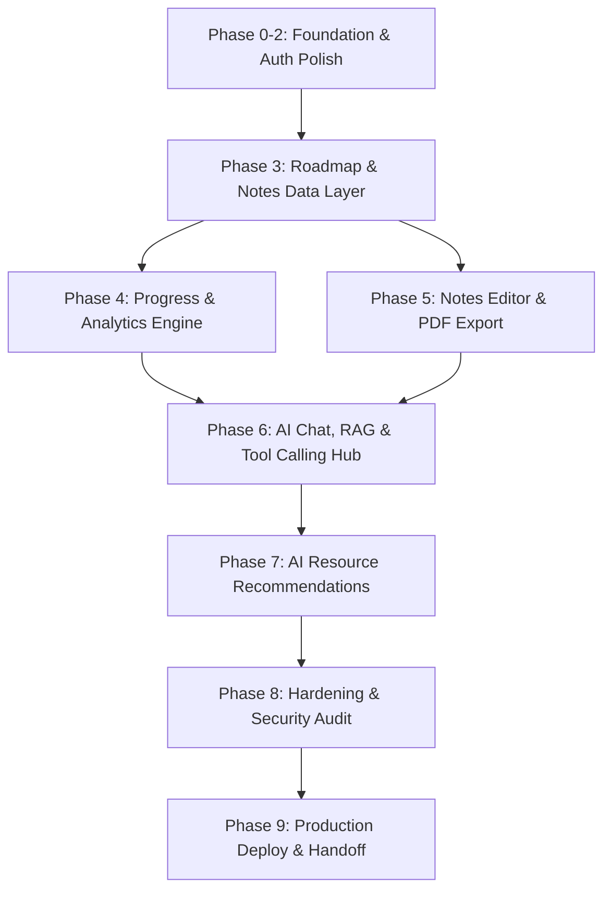

# LearnHub AI — Senior Project Inspection & Executive PM Report

**Inspected By:** Senior Project Inspector & Lead Project Manager  
**Date:** August 15, 2026  
**Target Baseline Documents:** [`phased-development-plan.md`](file:///c:/Users/Vasanth/Desktop/Antigravity-projects/LearnHub%20AI/docs/phased-development-plan.md), [`implementation-blueprint.md`](file:///c:/Users/Vasanth/Desktop/Antigravity-projects/LearnHub%20AI/docs/implementation-blueprint.md)  
**Current Codebase State:** Initial Foundation & Frontend Auth/Dashboard Scaffold Completed  

---

## 1. Executive Summary & Completion Scorecard

The **LearnHub AI** project has completed its baseline initialization, database schema drafting, UI design token system, frontend authentication flow, landing page, and dashboard layout. The codebase strictly adheres to the architecture outlined in `implementation-blueprint.md` (v2), leveraging a Turborepo monorepo with React (Vite) on the web frontend, Express on the backend server, and Supabase (Postgres with `pgvector`) for authentication, data storage, and future RAG capabilities.

### Overall Completion: **~30%**

```
[█████████░░░░░░░░░░░░░░░░░░░░░░░░░░] 30% Overall Progress
```

### Phase Completion Matrix

| Phase | Title | Target Scope | Completion % | Status | Key Highlights / Gaps |
|---|---|---|---|---|---|
| **Phase 0** | Foundation | Monorepo, Supabase Schema, RLS, Express & Vite apps | **85%** | 🟡 Near Done | Schema & UI tokens complete; GitHub Actions CI & layered Express structure pending. |
| **Phase 1** | Authentication | Email/Password, OAuth (Google/GitHub), Protected Routes | **85%** | 🟡 Near Done | Frontend Auth & Zod validation done; Backend `requireAuth` & rate limiting pending. |
| **Phase 2** | Core Application Shell | Landing, Dashboard Layout, Settings, Profile, Theme Toggle | **45%** | 🟠 In Progress | Landing & Dashboard UI complete; persistent Sidebar layout, Settings & Profile API pending. |
| **Phase 3** | Roadmap & Notes Data Layer | Database CRUD & manual viewing/editing UI (No AI yet) | **0%** | 🔴 Not Started | Schema ready; Backend routes, services, and Roadmap viewing UI yet to be created. |
| **Phase 4** | Progress Tracking & Analytics | Topic completion, streak calculation, dashboard stats | **0%** | 🔴 Not Started | Topic completion APIs, progress sessions, and real-time dashboard analytics pending. |
| **Phase 5** | Notes Polish | Rich text editor (Tiptap), search, version history, PDF export | **0%** | 🔴 Not Started | Notes UI, Postgres full-text search, versioning triggers, and PDF generator pending. |
| **Phase 6** | AI Chat + RAG + Tool Hub | Streaming Chat, pgvector RAG, Tool calling (`generate_*`) | **0%** | 🔴 Not Started | Gemini/Claude provider interface, tool handlers, vector search, and SSE stream pending. |
| **Phase 7** | Resource Recommendations | AI-suggested YouTube/Docs links, broken link reporting | **0%** | 🔴 Not Started | Resource JSON structures drafted in schema; tool integration and reporting API pending. |
| **Phase 8** | Hardening | RLS security audit, rate limiting, Sentry, error bounds | **0%** | 🔴 Not Started | Audit, production rate-limits, logging, and accessibility pass pending. |
| **Phase 9** | Deploy & Handoff | Vercel & Render production deploy, smoke test, docs | **0%** | 🔴 Not Started | Production environment provisioning and end-to-end verification pending. |

---

## 2. Completed Accomplishments (Audit of Completed Artifacts)

### 🗄️ Database & Schema ([`00000000000000_initial_schema.sql`](file:///c:/Users/Vasanth/Desktop/Antigravity-projects/LearnHub%20AI/supabase/migrations/00000000000000_initial_schema.sql))
- **Comprehensive Relational Model:** Created 12 core tables (`profiles`, `learning_goals`, `conversations`, `roadmaps`, `sprints`, `topics`, `notes`, `note_versions`, `messages`, `message_embeddings`, `progress_logs`, `ai_usage_logs`).
- **Vector Search Ready:** Enabled `pgvector` extension and set 768-dimension vector column on `message_embeddings`.
- **Security First:** Enabled Row Level Security (RLS) across **100% of tables** with ownership policies tied to `auth.uid()`.
- **User Auto-Provisioning:** Created Postgres trigger `on_auth_user_created` to automatically populate `profiles` from Supabase Auth metadata.

### 🎨 Frontend & Design System ([`apps/web`](file:///c:/Users/Vasanth/Desktop/Antigravity-projects/LearnHub%20AI/apps/web))
- **Design Tokens:** [`packages/ui-tokens`](file:///c:/Users/Vasanth/Desktop/Antigravity-projects/LearnHub%20AI/packages/ui-tokens/index.ts) properly implements custom palette tokens: Palladian (`#EEE9DF`), Oatmeal (`#C9C1B1`), Abyssal Anchorfish Blue (`#1B2632`), Blue Fantastic (`#2c3b4d`), Burning Flame (`#ffb162`), Truffle Trouble (`#a35139`), and typography rules (Inter + Literata).
- **Authentication Flows:** [`AuthPage.tsx`](file:///c:/Users/Vasanth/Desktop/Antigravity-projects/LearnHub%20AI/apps/web/src/pages/AuthPage.tsx) features styled login/signup tabs, Zod schema validation, password visibility toggles, and OAuth redirects (Google/GitHub).
- **Routing & State:** React Router set up in [`App.tsx`](file:///c:/Users/Vasanth/Desktop/Antigravity-projects/LearnHub%20AI/apps/web/src/App.tsx) with [`ProtectedRoute`](file:///c:/Users/Vasanth/Desktop/Antigravity-projects/LearnHub%20AI/apps/web/src/components/auth/ProtectedRoute.tsx) guards. State managed via Zustand (`authStore.ts`).
- **Landing & Dashboard Pages:** [`LandingPage.tsx`](file:///c:/Users/Vasanth/Desktop/Antigravity-projects/LearnHub%20AI/apps/web/src/pages/LandingPage.tsx) is fully styled. [`DashboardPage.tsx`](file:///c:/Users/Vasanth/Desktop/Antigravity-projects/LearnHub%20AI/apps/web/src/pages/DashboardPage.tsx) displays goal stats layout, user welcome header, active goal progress containers, and navigation shortcuts.

### ⚙️ Monorepo & Configuration ([`packages/`](file:///c:/Users/Vasanth/Desktop/Antigravity-projects/LearnHub%20AI/packages))
- Configured Turborepo monorepo structure with `npm` workspaces.
- Shared type definitions and Zod validation schemas established in [`packages/types/index.ts`](file:///c:/Users/Vasanth/Desktop/Antigravity-projects/LearnHub%20AI/packages/types/index.ts).
- Express server scaffolded in [`apps/server`](file:///c:/Users/Vasanth/Desktop/Antigravity-projects/LearnHub%20AI/apps/server/src/server.ts) with active `/api/health` endpoint.

---

## 3. High-Level Overview of Remaining Work

The foundational infrastructure is in place. Moving forward, the critical path transitions from static scaffolding to **backend API route development**, **manual CRUD UI features**, and ultimately the **AI RAG & Tool Generation Engine**.



### Critical Path Summary:
1. **Immediate Focus (Phase 0-2 Closure):** Refactor Express server into layered modular architecture (`routes → controllers → services → db`), add `requireAuth` middleware, wrap web routes in a persistent main layout (with sidebar navigation), and build Settings/Profile page.
2. **Data & CRUD Layer (Phases 3-5):** Build Express REST APIs and frontend interfaces for Goals, Roadmaps, Sprints, Topics, Notes, and Progress logs without AI logic first.
3. **Core Intelligence Layer (Phase 6):** Implement Gemini/Claude provider abstraction with Tool Calling (`generate_roadmap`, `generate_note`), SSE streaming response pipeline, pgvector RAG context retrieval, and conversation history.
4. **Refinement & Production Readiness (Phases 7-9):** Integrate resource recommendations, complete RLS security audits, rate-limiting, and deploy to Vercel and Render.

---

## 4. Detailed Phase-by-Phase Remaining Task Backlog

Below is the granular task checklist required to bring LearnHub AI to 100% completion according to the phased plan and implementation blueprint.

### 🟡 Phase 0 — Foundation (15% Remaining)
- [ ] **⚙️ DevOps:** Create `.github/workflows/ci.yml` for automated linting, typechecking, and building on PRs.
- [ ] **⚙️ DevOps:** Verify deployment pipelines on Vercel (`apps/web`) and Render (`apps/server`).
- [ ] **🔧 Backend:** Refactor `apps/server/src` into layered folder architecture (`modules/`, `middleware/`, `config/`, `db/`).
- [ ] **🔧 Backend:** Instantiate Supabase Server Client with service-role key for backend administrative queries.
- [ ] **🔧 Backend:** Implement global Express error-handling middleware returning standardized JSON error responses.
- [ ] **🎨 Frontend:** Wrap TanStack Query (`QueryClientProvider`) around `App.tsx` for client-side API state management.

### 🟡 Phase 1 — Authentication (15% Remaining)
- [ ] **🔧 Backend:** Implement `requireAuth` JWT validation middleware checking authorization headers against Supabase Auth.
- [ ] **🔒 Security:** Apply `express-rate-limit` middleware specifically to authentication endpoints.
- [ ] **🎨 Frontend:** Implement Forgot Password and Reset Password modal/page flows in `AuthPage.tsx`.

### 🟠 Phase 2 — Core Application Shell (55% Remaining)
- [ ] **🎨 Frontend:** Create a reusable `AppLayout` wrapper component containing persistent sidebar navigation (Dashboard, AI Chat, Roadmap, Notes, Settings) and top header.
- [ ] **🎨 Frontend:** Implement `/settings` page featuring theme switcher (light/dark mode persisted to profile/localstorage) and account preferences.
- [ ] **🎨 Frontend:** Implement Profile settings page with display name updates and download format preference ('pdf').
- [ ] **🎨 Frontend:** Add Avatar upload widget connected to Supabase Storage.
- [ ] **🔧 Backend:** Implement `GET /api/profile` and `PATCH /api/profile` endpoints.
- [ ] **🔧 Backend:** Implement `POST /api/profile/avatar` image upload handler.
- [ ] **🗄️ Database:** Configure Supabase Storage bucket (`avatars`) with signed URL access policies.

### 🔴 Phase 3 — Roadmap & Notes Data Layer (100% Remaining)
*Goal: Data structure, schema-backed REST endpoints, and manual UI views (No AI yet).*
- [ ] **🔧 Backend:** Create `learning_goals` routes (`POST /api/goals`, `GET /api/goals`).
- [ ] **🔧 Backend:** Create `roadmaps` routes (`GET /api/goals/:id/roadmap`, `POST /api/goals/:id/roadmap` for manual creation).
- [ ] **🔧 Backend:** Create `topics` edit route (`PATCH /api/topics/:id` for manual topic title/order updates).
- [ ] **🎨 Frontend:** Build `/roadmap` page with active goal switcher, sprint timeline tree view, expandable topic lists, and manual topic editing dialogs.
- [ ] **🎨 Frontend:** Connect Dashboard "Current Goal" and "All Goals" cards to live Supabase API queries.

### 🔴 Phase 4 — Progress Tracking & Analytics (100% Remaining)
- [ ] **🔧 Backend:** Implement `PATCH /api/topics/:id/complete` endpoint to toggle completion status and create a `progress_logs` record.
- [ ] **🔧 Backend:** Implement `POST /api/progress/session` endpoint to log study duration seconds.
- [ ] **🔧 Backend:** Implement `GET /api/analytics/summary` endpoint aggregating percentage completed, total study hours, active daily streak count, and estimated completion date.
- [ ] **🎨 Frontend:** Wire topic completion checkboxes to backend with optimistic UI updates (TanStack Query mutations).
- [ ] **🎨 Frontend:** Update Roadmap and Dashboard progress bars, streak badges, and time-spent widgets to reflect real-time analytics data.

### 🔴 Phase 5 — Notes Polish & Export (100% Remaining)
- [ ] **🔧 Backend:** Implement Notes CRUD endpoints (`POST`, `GET`, `PATCH`, `DELETE` `/api/notes`).
- [ ] **🔧 Backend:** Implement automatic versioning: on `PATCH /api/notes/:id`, push current markdown content to `note_versions` table before saving updates.
- [ ] **🔧 Backend:** Implement `GET /api/notes/:id/versions` and `GET /api/notes/:id/versions/:versionId` for history inspection and restoration.
- [ ] **🔧 Backend:** Implement full-text search endpoint `GET /api/notes/search?q=` using Postgres `tsvector`/`tsquery`.
- [ ] **🔧 Backend:** Implement PDF export endpoint `GET /api/notes/:id/pdf` using `pdf-lib` or Puppeteer to convert markdown into styled downloadable PDFs.
- [ ] **🎨 Frontend:** Build `/notes` page with grid/list view, title/content search bar, and Tiptap rich-text markdown editor.
- [ ] **🎨 Frontend:** Add visual badges to notes distinguishing `ai_generated` (linked to a topic) from `manual` notes.
- [ ] **🎨 Frontend:** Implement Note Version History UI drawer with restore options and "Download PDF" action.

### 🔴 Phase 6 — AI Chat, RAG & Tool Generation Hub (100% Remaining)
*Goal: Primary generation hub via streaming chat, tool calling, and RAG retrieval.*
- [ ] **🤖 AI Provider Layer:** Create unified AI provider interface in `apps/server/src/ai/providers/` supporting both Gemini (primary) and Claude (fallback) with tool calling capabilities.
- [ ] **🤖 AI Tools Definition:** Define Zod schemas and tool handlers in `apps/server/src/ai/tools/`:
  - `generate_roadmap({ goalTitle, durationWeeks })`: Generates structured sprint/topic JSON, inserts rows into DB, links `generated_from_conversation_id`.
  - `generate_note({ topicId, focus })`: Generates markdown note for topic, inserts into `notes` with `source='ai_generated'`.
  - `regenerate_roadmap({ goalId })`: Regenerates roadmap and increments version number.
- [ ] **🤖 RAG Engine:** Build embedding service using Gemini Embeddings (`text-embedding-004`) to chunk and upsert notes and chat messages into `message_embeddings`.
- [ ] **🤖 RAG Engine:** Build pgvector cosine similarity retrieval service to fetch top-k context passages scoped to `user_id` and active `goal_id`.
- [ ] **🔧 Backend:** Implement Server-Sent Events (SSE) chat endpoint `POST /api/conversations/:id/messages`.
- [ ] **🔧 Backend:** Integrate lightweight prompt moderation pre-check prior to model execution.
- [ ] **🔧 Backend:** Enforce daily AI usage quota check against `ai_usage_logs` before firing requests.
- [ ] **🎨 Frontend:** Build `/chat` page with conversation history sidebar, markdown streaming response window, typing indicators, and goal context selection.
- [ ] **🎨 Frontend:** Create interactive inline "Action Cards" in chat when tools finish executing (e.g. `[Roadmap Created - View]` or `[Note Generated - Open]`).

### 🔴 Phase 7 — Resource Recommendations (100% Remaining)
- [ ] **🤖 AI:** Update `generate_roadmap` tool prompt to generate categorized resource objects per topic (`{ youtube: [], courses: [], docs: [], other: [] }`).
- [ ] **🔧 Backend:** Implement `POST /api/topics/:id/report-resource` endpoint to log reported broken or inaccurate links.
- [ ] **🎨 Frontend:** Render resource recommendation cards per topic on the Roadmap page with external link icons and a "Report link" action button.

### 🔴 Phase 8 — Hardening & Security Audit (100% Remaining)
- [ ] **🔒 Security:** Perform comprehensive cross-user database access audit across all RLS policies.
- [ ] **🔒 Security:** Perform dependency audit (`npm audit`) and clean up high-severity vulnerabilities.
- [ ] **🔒 Security:** Audit client bundle output to guarantee zero leakages of backend service keys.
- [ ] **⚙️ DevOps:** Integrate Sentry error monitoring on both `apps/web` and `apps/server`.
- [ ] **⚙️ DevOps:** Set up structured logging (Winston/Pino) with correlation request IDs.
- [ ] **🎨 Frontend:** Perform accessibility audit (color contrast, ARIA labels, keyboard focus rings).
- [ ] **🎨 Frontend:** Implement global Error Boundaries and fallback UI states for empty or failing data states.

### 🔴 Phase 9 — Production Deployment & Handoff (100% Remaining)
- [ ] **⚙️ DevOps:** Provision production environment variables on Vercel and Render.
- [ ] **⚙️ DevOps:** Run full end-to-end smoke test on production deployment URL.
- [ ] **📄 Documentation:** Update `README.md` with complete local developer setup guide, environment variable definitions, and deployment commands.
- [ ] **📄 Documentation:** Create internal operations doc for tuning AI quotas and model model fallback thresholds.

---

## 5. Recommended Next Steps for Engineering

1. **Complete Phase 0 & 1 Polish (Est. 1-2 Days):**
   - Restructure `apps/server/src` into modules, services, and routes.
   - Add `requireAuth` middleware to Express server.
   - Add TanStack Query provider to `App.tsx`.
2. **Execute Phase 2 Shell Completion (Est. 2-3 Days):**
   - Build unified `AppLayout` with fixed Sidebar navigation across all routes.
   - Implement Settings and Profile pages with Supabase Storage avatar uploads.
3. **Build Phase 3 & 4 Data Layer (Est. 3-4 Days):**
   - Construct REST endpoints and database services for goals, roadmaps, topics, and notes.
   - Build manual Roadmap viewing UI and Progress tracking checkboxes.
4. **Build Phase 5 Notes System (Est. 3 Days):**
   - Integrate Tiptap editor and PDF export endpoint.
5. **Implement Phase 6 AI Chat & Tool Engine (Est. 5-7 Days):**
   - Implement Gemini/Claude provider with tool calling, pgvector RAG, and SSE streaming.

---
*Report generated autonomously by Senior Project Inspector AI.*
